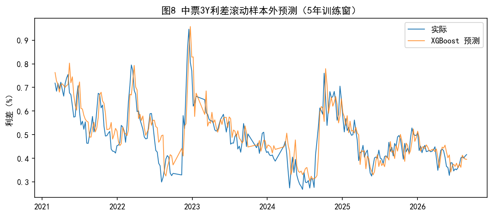

# 中国信用利差驱动因素研究：基于 XGBoost 与 SHAP 的可解释机器学习分析

**Credit Spread Drivers in China: An Interpretable Machine Learning Approach with XGBoost and SHAP**

     



一个面向学术论文的完整可复现量化研究项目：以中债信用债（中短期票据、商业银行债）与国债收益率的利差为研究对象，融合宏观经济、流动性、股市波动等 10 类外部特征与自回归滞后项，对比 OLS、随机森林与 XGBoost 的样本内解释力，并通过 SHAP 值分解特征贡献、expanding-window 滚动框架检验样本外预测能力。

---

## 目录结构

```
固收大作业/
├── README.md                 # 本文件
├── LICENSE                   # MIT 开源许可
├── requirements.txt          # 依赖（含 xgboost>=2.0,<3 兼容性锁定）
├── .gitignore
├── src/
│   ├── 01_fetch_data.py      # akshare 数据获取（含重试与降级逻辑）
│   ├── 02_features.py        # 周频对齐、利差构建、无泄漏宏观特征
│   ├── 03_model.py           # OLS/RF/XGBoost 建模 + GridSearch + SHAP
│   ├── 04_rolling_eval.py    # expanding-window 滚动样本外评估
│   └── 05_figures.py         # 论文图表一键产出（9 图 3 表）
├── tests/                    # pytest 测试（每个 src 模块对应）
├── data/
│   ├── raw/                  # akshare 原始数据（离线缓存）
│   └── processed/            # 对齐后的建模数据与全部结果
├── figures/                  # fig1-9 论文图（PNG）
├── tables/                   # table1-3 论文表（CSV）
└── docs/superpowers/         # 设计文档与实施计划
    ├── specs/2026-09-29-credit-spread-xgboost-design.md
    └── plans/2026-09-29-credit-spread-implementation.md
```

## 复现步骤

环境要求：Windows + Python 3.10（`py` launcher 可用）。

```powershell
# 1. 创建虚拟环境并安装依赖
py -m venv .venv
.\.venv\Scripts\Activate.ps1
pip install -r requirements.txt

# 2. 数据获取（联网，约 2-5 分钟；接口失效时自动降级）
py src\01_fetch_data.py

# 3. 特征工程（周频对齐 + 利差构建 + 宏观无泄漏滞后）
py src\02_features.py

# 4. 建模与 SHAP（OLS/RF/XGB + GridSearchCV + SHAP 重要性）
py src\03_model.py

# 5. 滚动样本外评估（5 年训练窗，每 4 周步进）
py src\04_rolling_eval.py

# 6. 论文图表（figures/ 与 tables/ 一键产出）
py src\05_figures.py

# 7. 全量测试
pytest tests -q
```

> 提示：`data/raw/` 已含历史数据缓存，纯复现（不重新联网抓取）可从步骤 3 开始。

## 数据说明

| 数据 | 来源接口 | 说明 |
|---|---|---|
| 中债收益率曲线 | `bond_china_yield` | 中短期票据 AAA、商业银行债 AAA、国债（2015-01 起） |
| SHIBOR 3M | `rate_interbank` | 流动性代理（R007 接口失效后降级方案） |
| 沪深300 | `stock_zh_index_daily` | 新浪源（东财源限流降级），周收益率与波动率 |
| CPI/PPI/PMI | `macro_china_*` | 月频，次月月初对齐到周频 |
| M2 / 社融 | `macro_china_*` | 社融取 12 月滚动和以剔除季节噪声 |

**利差定义**：信用债收益率 − 同期限国债收益率，构成 2 品种（中票/商行债）× 2 期限（3Y/5Y）共 4 条利差目标变量。

**无泄漏设计**：宏观月频变量在其所属月份结束后（次月月初）才进入特征集；滚动预测严格使用截至预测时点的信息。

## 主要结果

### 1. 样本内：非线性机制显著

测试集 R²（3Y 利差）：

| 目标 | OLS | 随机森林 | XGBoost |
|---|---|---|---|
| 中票3Y | -0.633 | **0.431** | 0.356 |
| 商行债3Y | -0.697 | **0.685** | 0.620 |

3Y 利差上线性基准全面失效（R² 为负），树模型取得 0.36-0.69 的解释力，为"信用利差驱动关系非线性"提供了直接证据。5Y 利差（利差极低、走势平稳）样本外表现弱，作为期限异质性的稳健性讨论对象。

### 2. SHAP：自回归 + 流动性双重主导

以中票3Y 为例，平均 |SHAP| 前 5 特征：

| 特征 | 平均 \|SHAP\| |
|---|---|
| 利差滞后 1 周（lag_1） | 0.269 |
| SHIBOR 3M | 0.089 |
| 10Y 国债收益率水平 | 0.011 |
| 利差滞后 4 周（lag_4） | 0.008 |
| PPI | 0.005 |

结论：利差短期动能（自回归）与流动性环境（SHIBOR）贡献了绝大部分可解释变异，宏观基本面变量（CPI/PPI/PMI/M2）边际贡献有限——与 Collin-Dufresne et al. (2001) "宏观基本面难以解释利差变化"的经典发现一致。

### 3. 样本外：滚动预测全面优于随机游走

expanding-window（5 年训练窗、每 4 周重训）结果：

| 品种 | RMSE | 随机游走 RMSE | RMSE 改进 | 方向准确率 |
|---|---|---|---|---|
| 中票3Y | 0.0617 | 0.0827 | **+25.4%** | 48.5% |
| 中票5Y | 0.0531 | 0.0646 | +17.8% | **54.9%** |
| 商行债3Y | 0.0492 | 0.0592 | +17.0% | 46.2% |
| 商行债5Y | 0.0530 | 0.0583 | +9.1% | 47.7% |

四条利差的 RMSE 全部优于随机游走（改进 9%-25%），说明模型在样本外具备真实预测增量。

## 学术定位

- **创新点 1**：以非线性机器学习刻画利差驱动机制，为 OLS 失效提供解释力证据；
- **创新点 2**：SHAP 分解时变特征重要性，回答"什么在驱动利差"；
- **创新点 3**：品种 × 期限异质性（中票 vs 商行债、3Y vs 5Y）；
- **创新点 4**：严格样本外滚动评估，规避过拟合粉饰。

## 技术栈

Python 3.10 · pandas · numpy · scikit-learn · xgboost (2.1.4) · shap (0.49) · akshare (1.18.88) · matplotlib · pytest
